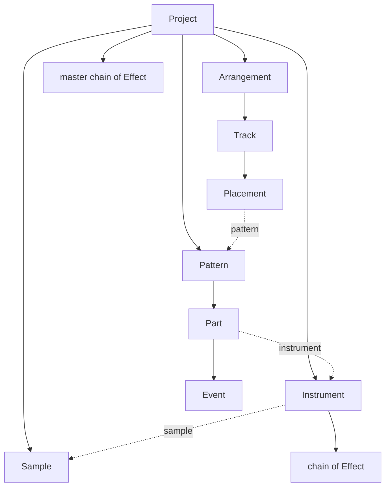

# Spec — The Project data model

- **Status:** Frozen contract. Changes require a superseding ADR.
- **Authority:** [`ADR-005`](../adrs/ADR-005-project-data-model.md) decides; this document states the contract.
- **Amended by:** [`ADR-060`](../adrs/ADR-060-musical-content-root.md) — §3.1 splits into `ProjectMeta` and `MusicalContent`; §5.1 and §6 state which surface `apply` is the door to; I11 is added.
- **Derived from:** `docs/CORE_DOCUMENT.md` §3.7, §3.8, §3.9, §5, §6.3, §8.1, §9.
- **Issue:** #5

`docs/CORE_DOCUMENT.md` §5 is the binding vocabulary and remains authoritative. This document
extends it with the terms the data model needs and contradicts it nowhere. There is deliberately
no separate `CONTEXT.md` glossary: a second copy of §5 would be a place for the vocabulary to
drift, and drift is the defect §5 exists to prevent.

Notation is language-neutral. No implementation language has been chosen; nothing here presumes one.

---

## 1. Shape of the model

A **Project** is a set of entities addressed by opaque **Id**, not a nested document.

- Every entity has a globally unique, opaque `Id`, assigned at creation, never reused.
- Each entity is **owned** by exactly one parent (an ownership tree).
- Entities refer to entities outside their own subtree **by `Id`** (a reference graph).
- Position in a collection is never an address. Only `Id` is an address.

This is the decision every other requirement rests on: because entities are addressed by `Id`,
every mutation is expressible as *"this field, on this entity"* — which is what §3.8's
single-purpose Functions and §3.9's deltas both need.



Solid edges are ownership. Dashed edges are `Id` references.

---

## 2. Every §5 term, placed

No orphans, no synonyms. Each binding term maps to exactly one thing.

| §5 term | Where it lives in the model |
|---|---|
| **Studio** | The application. Not in the Project. |
| **Project** | Root entity `Project` (§3.1). |
| **Pattern** | Entity `Pattern` (§3.4). One concept covering drum steps and melody notes. |
| **Arrangement** | Entity `Arrangement` (§3.7). Exactly one per Project in the MVP. |
| **Track** | Entity `Track` (§3.8). One lane in the Arrangement. |
| **Sample** | Entity `Sample` (§3.2). |
| **Instrument** | Entity `Instrument` (§3.3). The only thing that turns Events into audio. |
| **Effect** | Entity `Effect` (§3.10), held in an **effect chain**. |
| **Plugin** | Post-MVP. A named extension point only: a further `Instrument.kind` and `Effect.kind`. Not defined here. |
| **Assistant** | Not a Project entity. Appears as `Delta.actor = Assistant` and as a `Provenance` source. |
| **Sub-agent** | Not in the Project. May be named in `Provenance.source`. |
| **Function** | Not in the Project. Constrains it: one Function produces exactly one `Delta` (§5.3). |
| **Function file** | Not in the Project. It is Settings, which §9.1 places outside the Assistant's reach entirely. |
| **Mixer** | Post-MVP. Attaches as an additional holder of an **effect chain** (§3.10). No model change required. |

### 2.1 Terms this spec adds

Each is taken from the core document's own prose where possible, which is the cheapest way to
avoid a synonym defect.

| Term | Meaning | Why it is not a synonym |
|---|---|---|
| **Event** | One note or step: start, duration, pitch, velocity. | §5 already defines Pattern as "a block of note or step **events**". |
| **Part** | The Events of one Instrument within one Pattern. | A **Track** is a lane in the *Arrangement*; a **Part** is a group of Events inside a *Pattern*. Different container, different lifetime. |
| **Placement** | One appearance of a Pattern on a Track at a time. | A Pattern is the material; a Placement is an instance of it. |
| **Effect chain** | An ordered list of Effects held by one owner. | A composite of Effects, not a new kind of processor. |
| **Provenance** | Per-Sample and per-Pattern origin record. | §6.3's own word — "AI provenance tracking". |
| **Delta** | One atomic, invertible change to the Project. | §3.9's own word — "let's store delta's". |
| **Edit** | The atom a Delta is made of. | Below Delta; has no §5 counterpart. |
| **ProjectHistory** | The module that owns the Project and is the only thing that mutates it. | §3.9's "history", named as a module. |

**Retired terms remain retired** (§5.1). *choreography*, *sound*, *sound file*, *tune*, *song*,
and *plugin* used for a built-in processor must not appear in any identifier, field name, type
name, or enum value.

---

## 3. Entities

### 3.0 Primitive types

| Type | Definition | Why |
|---|---|---|
| `Id` | Opaque, globally unique, stable, never reused. UUIDv4 or equivalent. Carries no meaning, no prefix, no branding. | Addressability (§1) and §8.1. |
| `Ticks` | Signed 64-bit integer. **PPQ = 960**, fixed by this contract, not per-Project. | Exact equality. Deltas must round-trip bit-for-bit (invariant I4); floating-point time cannot promise that. 960 = 2⁶·3·5, so triplets and quintuplets land on integers. |
| `Pitch` | Integer 0–127. 60 = middle C. | MIDI-native, exact, ready for §3.6's MIDI hardware. |
| `Velocity` | Integer 0–127. | Same. |
| `Unit` | 32-bit float in [0, 1]. Gain-like Instrument and Effect parameters only. | Continuous controls are genuinely continuous. Never used for time, pitch or velocity. |

### 3.1 Project

A Project has two halves, and which half a thing is in decides whether a **Function** can reach it
(function-surface §1, ADR-060). The split is structural: `MusicalContent` holds no reference to
`ProjectMeta`, so there is nothing for a Function to reach *through*.

| Field | Type | Notes |
|---|---|---|
| `meta` | `ProjectMeta` (§3.1.1) | The document, as distinct from what it sounds like. **Unreachable from a Function.** |
| `musical` | `MusicalContent` (§3.1.2) | The musical content. **The only object a Function ever receives.** |

#### 3.1.1 ProjectMeta

| Field | Type | Notes |
|---|---|---|
| `id` | `Id` | |
| `format_version` | integer | Numeric only. Never a branded string (§8.1). |
| `title` | string | The **user's** title for their work. Unrelated to the product name. |

This is where non-musical document state goes: the Project's file path and save metadata among it,
if the serialisation issue (§7.1) wants them in the document at all. Nothing added here becomes
visible to a Function and no Function signature changes when it arrives — that is the whole point
of the split, and `tests/test_reach_rule.cpp` is the proof.

`ProjectMeta` is **not** delta-managed (§5.1). It is written when a document is created or loaded.

#### 3.1.2 MusicalContent

| Field | Type | Notes |
|---|---|---|
| `tempo` | float BPM | The frame. Constant for the whole Project in the MVP; tempo automation is out of scope (§7.3). |
| `time_signature` | (integer, integer) | The frame. Constant for the whole Project in the MVP. |
| `samples` | ordered map `Id → Sample` | Owned. |
| `instruments` | ordered map `Id → Instrument` | Owned. |
| `patterns` | ordered map `Id → Pattern` | Owned. |
| `arrangements` | ordered map `Id → Arrangement` | Owned. Exactly one entry in the MVP. |
| `master_chain` | list of `Effect` | Owned. Ordered, may be empty. |

**Membership test.** A field belongs in `MusicalContent` **iff changing it changes what the
renderer produces** — `engine::bake` takes exactly this type and nothing else. Tempo passes; a file
path does not. The test is mechanical so that the boundary does not drift on taste.

Adding a field here widens what the Assistant can reach, and is a deliberate, reviewable act: the
census in `tests/test_reach_rule.cpp` stops compiling until whoever added it names it there.

`arrangements` is a map holding one entry rather than a single field, so that multiple
Arrangements later become an addition rather than a contract change.

### 3.2 Sample

| Field | Type | Notes |
|---|---|---|
| `id` | `Id` | |
| `name` | string | |
| `source` | `SampleSource` | Opaque handle to the audio. Whether bytes are embedded or linked is decided by the serialisation issue (§7.1). |
| `provenance` | `Provenance` | Mandatory (§6.3). |

A Sample is a resource. It never appears on a Track or in a Pattern directly; it reaches audio
only through an Instrument (§3.3).

### 3.3 Instrument

Turns Events into audio. The **only** producer of sound in the model.

| Field | Type | Notes |
|---|---|---|
| `id` | `Id` | |
| `name` | string | |
| `kind` | `InstrumentKind` | **The MVP defines exactly one: `Sampler`.** `Synth` and `Plugin` are named extension points, not defined here. |
| `params` | determined by `kind` | See below. |
| `chain` | list of `Effect` | Owned, ordered, may be empty. |

`Sampler` params:

| Field | Type | Notes |
|---|---|---|
| `sample` | `Id` → Sample | Reference. |
| `root_pitch` | `Pitch` | The Pitch at which the Sample plays at its native rate. |
| `start_offset`, `end_offset` | `Ticks` | Trim into the Sample. Serves recorded takes without any audio-specific field on Event. |
| `mode` | `OneShot` \| `Sustain` | `OneShot` ignores Event duration — the drum-step case. |
| `gain`, `pan` | `Unit` | |

**Consequence worth knowing:** with `Sampler` as the only MVP kind, every sound in the MVP comes
from a Sample. That is consistent with §3.5, which lists stock Samples and no synthesiser, and with
Appendix A.2, which supplies pitched acoustic content for the piano roll. It is a real product
implication and is flagged in ADR-005's open items.

### 3.4 Pattern

One concept covering drum steps and melody notes. There is no `DrumPattern` and no `MelodyPattern`.

| Field | Type | Notes |
|---|---|---|
| `id` | `Id` | |
| `name` | string | |
| `length` | `Ticks` | Authored, not derived from its Events. An empty Pattern still has a length. |
| `parts` | ordered list of `Part` | Owned. Order is the step-sequencer row order. |
| `provenance` | `Provenance` | Mandatory (§6.3). |
| `colour` | optional colour | Authored presentation, see §3.11. |

The step sequencer and the piano roll are **two views over the same Pattern**. The step grid is a
property of the editing surface, not of the data: a drum step is an Event whose start is snapped to
the grid and whose Instrument is in `OneShot` mode.

### 3.5 Part

The Events of one Instrument within one Pattern.

| Field | Type | Notes |
|---|---|---|
| `id` | `Id` | |
| `instrument` | `Id` → Instrument | Reference. **This single field is what `change_instrument` writes.** |
| `events` | list of `Event` | Owned. Unordered as data; sorted by `start` for display. |
| `muted` | boolean | |

### 3.6 Event

| Field | Type | Notes |
|---|---|---|
| `id` | `Id` | Events are addressable, so per-note mutations touch exactly one thing. |
| `start` | `Ticks` | Relative to the start of the Pattern. |
| `duration` | `Ticks` | Greater than zero. Ignored by `OneShot` Instruments. |
| `pitch` | `Pitch` | |
| `velocity` | `Velocity` | |

An Event carries no reference to an Instrument or a Sample. Its sound source is its Part's.

### 3.7 Arrangement

The timeline where Patterns are assembled into the finished piece.

| Field | Type | Notes |
|---|---|---|
| `id` | `Id` | |
| `name` | string | |
| `tracks` | ordered list of `Track` | Owned. Order is top-to-bottom in the view. |

### 3.8 Track

One lane in the Arrangement.

| Field | Type | Notes |
|---|---|---|
| `id` | `Id` | |
| `name` | string | |
| `placements` | list of `Placement` | Owned. |
| `muted` | boolean | |
| `colour` | optional colour | |

A Track has no effect chain in the MVP. Per-Track processing is the Mixer, which is post-MVP
(core document §3.6).

### 3.9 Placement

One appearance of a Pattern on a Track.

| Field | Type | Notes |
|---|---|---|
| `id` | `Id` | |
| `pattern` | `Id` → Pattern | Reference. |
| `start` | `Ticks` | Position on the Arrangement timeline. |
| `length` | `Ticks` | Longer than the Pattern's length loops it to fill; shorter trims it. |
| `muted` | boolean | |

**Everything on a Track is a Placement of a Pattern.** There is no second placement type for audio.
A recorded take reaches the timeline as: Sample → `Sampler` Instrument → Part with one Event →
Pattern → Placement. The cost and the reasoning are in ADR-005.

### 3.10 Effect

An instance of one of the six built-in Effects (core document §3.4; implementations in ADR-001).

| Field | Type | Notes |
|---|---|---|
| `id` | `Id` | |
| `type` | `EffectType` | One of the six. |
| `enabled` | boolean | |
| `params` | map `string → float` | |

The data model freezes the **container**, not the contents. It does not know that an EQ has bands.
Each `EffectType`'s parameter schema is owned by the Effect specification, so ADR-001's
implementation picks can be refined without touching this contract.

An **effect chain** is an ordered list of owned Effects. In the MVP its holders are `Instrument`
and `Project` (master). The Mixer, when it arrives, becomes a third holder of the same concept.

### 3.11 What is deliberately not in the model

- **Transient view state** — zoom, scroll, selection, panel sizes, the currently open editor. Not
  in `MusicalContent`, and not in `ProjectMeta` either: it is not in the Project at all. It lives in
  the widgets that own it.
- **Settings of any kind** (§9.1).
- **Derived values** — the Project's AI-content rollup, waveform peaks, per-Pattern occupancy,
  events sorted by start, the `Id` lookup index. All computed, never stored.

The rule: **authored attributes that must survive a reload belong in the model; anything a reload
can recompute, or a user can re-establish in a second, does not.** `colour` is in; scroll position
is out.

---

## 4. Provenance

```
Provenance =
  | Human
  | Generated { source: string, at: timestamp }
```

`source` names the model or agent that produced the content, because §6.2's warning and §6.4's
handpicked-model list both depend on *what* generated it, not merely *that* something did. The
boolean §6.3 asks for is `provenance != Human` — derived, never stored separately.

Carried by **`Sample` and `Pattern` only** — exactly the two entities §6.3 names. Not by Project,
not by Part, not by Event.

### Rules

| # | Rule |
|---|---|
| P1 | Provenance is set when content is created, and when an Assistant mutation changes that content. |
| P2 | Provenance is **never silently cleared**. Human editing of generated content does not launder it (§9.4). Enforced by omission: an ordinary edit's Delta simply contains no Edit to the `provenance` field. |
| P3 | Provenance **propagates on copy**. Duplicating a `Generated` Pattern yields a `Generated` Pattern. |
| P4 | Provenance is **data in the Delta** like any other field, so `undo` restores it. Undoing an AI rework returns the Pattern to `Human`, which is correct — the generated content is gone with it. |
| P5 | Whether a Project contains AI-generated content is **computed** by walking the reference graph. Never stored, so it cannot go stale, and a mutation that would otherwise touch one thing is never forced to touch two. |
| P6 | Provenance is per-entity and does not spread across references. A `Human` Pattern whose Part targets an Instrument playing a `Generated` Sample stays `Human`; the Sample stays `Generated`; the interface shows both marks. |

---

## 5. Mutation

### 5.1 The only way to change a Project

```
ProjectHistory
    read()              -> read-only view of the Project
    apply(delta: Delta) -> Result
    undo()              -> Result
    redo()              -> Result
```

**Entities expose no public mutators.** `ProjectHistory` owns the Project and `apply` is the only
door to its **musical content**. Four operations hide identity allocation, referential-integrity
checking, atomicity, delta inversion and redo-tail truncation.

A `Delta` is typed on `MusicalContent`, not on the Project (ADR-060): it is, by its type, a change
to the musical content and to nothing else. This is what makes §9.1 hold on the write side as well
as the read side — a Function computes a change rather than performing one, so a `Delta` able to
address the whole document would hand back the reach the Function's own parameter denies it.

`ProjectMeta` is consequently outside the history: it is written when a document is created or
loaded, by the module that owns save and load, and never by a Function. Making a metadata edit
undoable is a superseding decision — a second Op kind over `ProjectMeta` — never a widening of
`Op`.

The Project itself holds no history. History sits *above* the Project, not inside it — which is
what makes §9.7 structural: an Assistant with complete reach over musical content still cannot
reach the record of what it did.

### 5.2 Delta and Edit

```
Delta = { id: Id, actor: User | Assistant, at: timestamp, edits: [Edit] }

Edit =
  | Set    { target: Id, field: name, before: value, after: value }
  | Insert { owner: Id, collection: name, index: int, entity: snapshot }
  | Remove { owner: Id, collection: name, index: int, entity: snapshot }
```

Inversion is total and local:

- `Set` inverts by swapping `before` and `after`.
- `Insert` inverts to `Remove` with the same snapshot, and back.
- `inverse(Delta)` reverses the edit list and inverts each Edit.

`before` is stored so undo costs the size of the edit and never replays from the origin. `Remove`
carries a full snapshot so it is reversible without one.

### 5.3 One Function, one Delta

A Function (surface defined by a separate issue) produces **exactly one** Delta. All of its Edits
apply, or none do. This is the contract that makes §3.8 and §3.9 the same guarantee:

- *touches exactly one thing* — the Delta shows precisely what it touched, and nothing else;
- *no Assistant action is irreversible* (§9.7) — every Delta has an inverse, by construction.

Compound operations are still one Delta. Deleting an Instrument that Parts reference is a single
Delta containing the Instrument's `Remove` **and** every Edit that resolves the dangling
references, so its inverse restores all of them together.

### 5.4 History

Linear and Word-style (§3.9): a list of Deltas and a cursor. `undo` moves the cursor back and
applies the inverse; `redo` moves it forward and reapplies. `apply` while the cursor is not at the
head **discards every Delta after the cursor** before appending.

---

## 6. Frozen invariants

These are the contract. Each is mechanically checkable and should have a test.

| # | Invariant |
|---|---|
| I1 | Every entity has a stable, globally unique, opaque `Id`, assigned at creation and never reused. Position is never an address. |
| I2 | `ProjectHistory.apply` is the only way to mutate a Project's **musical content**. Entities expose no public mutators. `ProjectMeta` is written only by the document layer, on create and load. |
| I3 | One Function produces exactly one Delta. A Delta is atomic: all Edits apply or none. |
| I4 | `undo(apply(p, d)) == p` for every Project `p` and Delta `d`, and `redo(undo(apply(p, d))) == apply(p, d)`. Bit-for-bit. |
| I5 | Applying a Delta while the cursor is not at the head discards everything after the cursor. |
| I6 | Every Delta records its `actor`. |
| I7 | Provenance is stored on `Sample` and `Pattern` only, never silently cleared, never rolled up into stored state. |
| I8 | No dangling references. Every `Id` reference resolves to a live entity in the same Project. |
| I9 | All musical time is integer `Ticks` at PPQ 960; pitch and velocity are integers 0–127. |
| I10 | No type name, field name, enum value, `Id` prefix, namespace or format constant contains the product name or any part of it (§8.1), and no retired §5.1 term appears in any identifier. |
| I11 | A **Function** receives `MusicalContent` and nothing else, and a `Delta` addresses `MusicalContent` and nothing else. No path exists from `MusicalContent` to `ProjectMeta`, to Settings, or to the filesystem (function-surface §1). |

I11 is enforced three ways, all in CI: a compile-time census of `MusicalContent`, `ProjectMeta` and
`Project` that fails to build when a member is added or moved; a `static_assert` per Function that
its first parameter is `const MusicalContent&`; and `tests/reach_rule_lint.py`, which fails when any
`*_functions.h` or `*_functions.cpp` names a `Project`-rooted identifier at all — the check that
covers Functions nobody has written yet. All three live in `tests/`.

I10 is enforced by a lint over **identifiers** — type names, field names, enum values, namespaces
and format constants, in source and in the schema tables above — failing on `fruity`, `claw`,
`choreograph`, `sound`, `tune`, `song`, and on `plugin` used for a built-in processor. Prose may
name a retired term in order to retire it; an identifier may not. A constraint nobody checks is a
comment.

---

## 7. Handoffs

### 7.1 Serialisation — separate issue

This contract names no file format, extension or magic number. Two things it does constrain:
`format_version` is numeric (§8.1), and §9.6 — *the Studio must never lose a Project* — pressures
the `Sample.source` decision toward embedding audio rather than linking it, because a linked Sample
can go missing. That decision belongs to the serialisation issue; the pressure is recorded here so
it is not rediscovered late.

### 7.2 The Function surface — separate issue

It must honour:

- one Function, one Delta (§5.3);
- **Directive** Functions take `Id`s and scalars only — that is what makes it *structurally* true
  that no Project content leaves the machine (§8.4). `change_instrument(part, instrument)` is two
  `Id`s; there is nothing in the call for a model to read;
- **Rework** Functions read Project content and are labelled as such in the switchboard (§8.4).

### 7.3 Not designed here, and deliberately so

| Gap | Where it will attach |
|---|---|
| Parameter automation and envelopes | Not in the MVP list (§3.5). Will attach as a further `Part` kind or `Placement` kind. Named, not designed. |
| Tempo and time-signature changes within a Project | Same. Currently Project-level constants. |
| Mixer routing, sends, buses | Post-MVP (§3.6). Attaches as a further holder of an effect chain. |
| Third-party `Plugin` | Post-MVP. A further `Instrument.kind` and `Effect.kind`. |
| Per-`EffectType` parameter schemas | Owned by the Effect specification, not by this contract (§3.10). |
